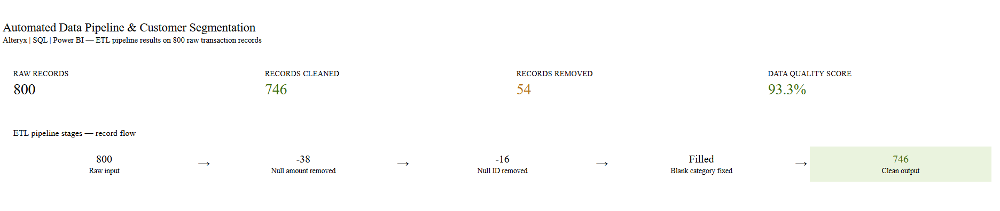

# customer-segmentation-etl
Customer segmentation and ETL automation project using Python, SQL concepts, Excel, and Power BI for transaction analysis and business intelligence reporting.
# Customer Segmentation & ETL Automation


---

## Overview

This project focuses on automated ETL workflows and customer segmentation using Python-generated transactional datasets and Power BI dashboards.

The solution helps businesses analyze:
- Customer spending behavior
- Transaction patterns
- High-value customer segments
- Revenue contribution
- Business intelligence KPIs

---

## Business Problem

Organizations often struggle with fragmented transaction data and lack visibility into customer purchasing behavior. This project demonstrates how ETL automation and customer segmentation can improve analytics and business decision-making.

---

## Tools Used

- Python
- Pandas
- NumPy
- Excel/CSV
- Power BI
- SQL Concepts

---

## Key Features

- Automated ETL Pipeline
- Customer Segmentation
- Transaction Analysis
- Data Cleaning & Transformation
- Power BI Dashboarding
- KPI Monitoring

---

## Business Impact

- Reduced manual data processing effort
- Improved customer behavior analysis
- Faster business reporting
- Better segmentation-driven decision-making

---

## Project Structure

```text
customer-segmentation-etl/
│
├── data/
│   ├── raw_transactions.csv
│   ├── cleaned_transactions.csv
│
├── notebooks/
│   ├── etl_pipeline.py
│
├── dashboard/
│   ├── powerbi_instructions.md
│   └── screenshots/
│
├── README.md
├── LICENSE
├── .gitignore
```

---

## Dashboard KPIs

- Total Transactions
- Average Transaction Value
- High Value Customers
- Revenue by Segment
- Customer Distribution

---

## Dashboard Preview

### Customer Segmentation Dashboard


### Transaction Analysis Dashboard


### Revenue Insights Dashboard


---

## Key Insights

- High-value customers contribute majority of revenue
- Shopping and travel categories drive higher transaction values
- Segmentation improves targeted business strategies
- Automated ETL improves reporting efficiency

---

## Skills Demonstrated

- ETL Automation
- Data Cleaning
- Customer Analytics
- Power BI Dashboarding
- KPI Reporting
- Business Intelligence
- Data Transformation

---

## Author

Juhi Nakhale  
Data Analyst | Power BI | Fintech Analytics
